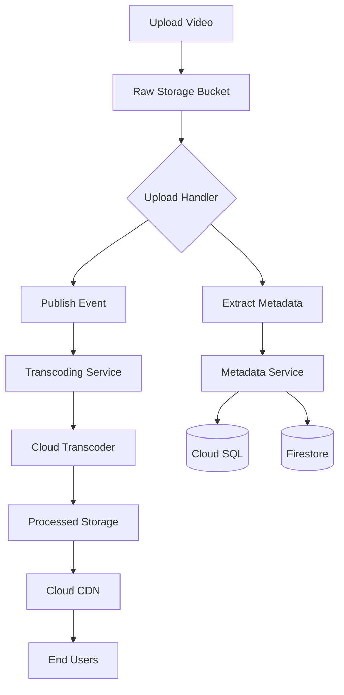

# Cinematik - GCP Architecture Documentation

## Overview

This document outlines the architecture for a streaming platform build on Google Cloud Platform (GCP). The system is designed to handle video content management, processing and streaming at scale.

## Core Components

### 1. Content Ingestion and Processing:

#### Storage

- **Raw Content Bucket**
  - Stores original uploaded video files
  - Triggers processing pipeline
  - Lifecycle policies for cost optimization
- **Processed Content Bucket**
  - Stores HLS/transcoded content
  - Multi-regional for better delivery
  - CDN integration
- **Asset Bucket**
  - Thumbnails
  - Preview clips
  - Poster images

#### Processing Pipeline

- **Upload Handler (Cloud Function)**

  - Listens to raw content bucket
  - Extracts video metadata
  - Publishes processing event
  - Validates file format and quality

- **Transcoding Service (Cloud Run)**
  - Subscribes to processing events
  - Uses Cloud Transcoder API
  - Generates multiple quality variants
  - Creates HLS manifests
  - Handles parallel processing

### 2. Metadata Management

#### Storage Solutions

- **Cloud SQL**
  - Primary metadata storage
  - Structured content information
  - Relationships between content
- **Firestore**

  - User-specific data
  - Watch history
  - Preferences
  - Dynamic content attributes

- **Redis/Memcached**
  - Metadata caching
  - Session management
  - Frequently accessed data

#### Services

- **Metadata Service (Cloud Run)**
  - Metadata CRUD operations
  - Search functionality
  - Content categorization
  - API endpoints for content discovery

### 3. Content Delivery

#### CDN Architecture

- **Cloud CDN**
  - Global content delivery
  - Edge caching
  - Load balancing
  - Geographic routing

#### Streaming

- **Multi-bitrate Streaming**
  - Adaptive quality selection
  - Bandwidth optimization
  - Buffer management
  - Resume capability

### 4. Monitoring & Analytics

- **Cloud Monitoring**

  - Service health
  - Performance metrics
  - Resource utilization
  - Cost tracking

- **Error Tracking**

  - Error logging
  - Alert management
  - Debugging support

- **Analytics Pipeline**
  - User behavior tracking
  - Content popularity
  - Quality of service metrics
  - BigQuery integration

## Event Flow

