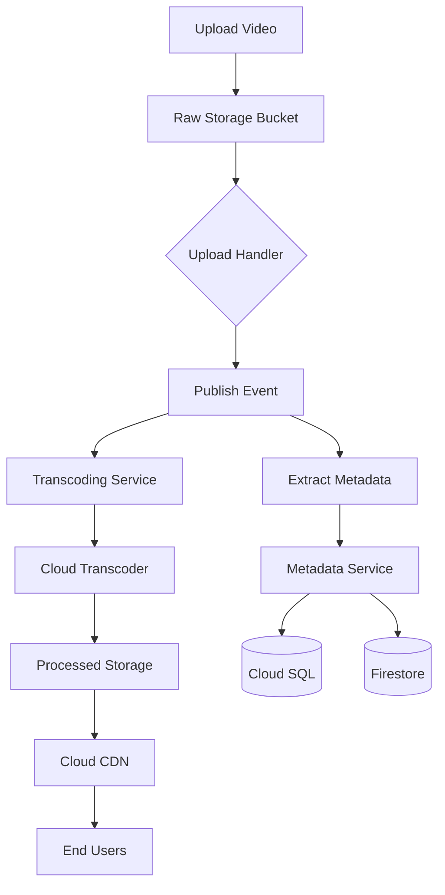

# Cinematik - GCP Architecture Documentation

## Overview

This document outlines the architecture for a streaming platform build on Google Cloud Platform (GCP). The system is designed to handle video content management, processing and streaming at scale.

## Event Flow

